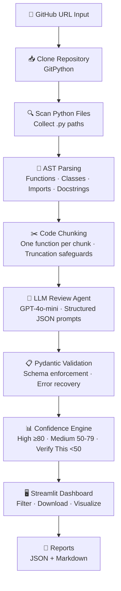

# 🤖 AI Code Review Agent

> An autonomous AI-powered code review agent that clones GitHub repositories, analyzes Python source code using AST parsing, and generates confidence-rated review comments via a Streamlit dashboard.

[](https://python.org)
[](https://streamlit.io)
[](https://openai.com)
[](https://opensource.org/licenses/MIT)
[](https://openrouter.ai)

🔗 **Live Demo:** `https://your-app.streamlit.app` ← _replace with your Streamlit Cloud URL after deployment_  
📁 **GitHub:** `https://github.com/yourusername/ai-code-review-agent` ← _replace with your repo URL_

---

## 📌 Project Overview

This project implements a multi-step agentic AI pipeline for automated code review:

1. **Clone** — Accepts a public GitHub URL and clones the repository using GitPython
2. **Parse** — Scans all `.py` files and extracts functions, classes, imports, and docstrings using Python's built-in `ast` module
3. **Chunk** — Splits code into reviewable units (one function/class per LLM call) to avoid token overflow and maximize review quality
4. **Review** — Sends structured prompts to OpenAI GPT-4o-mini and receives strict JSON review comments
5. **Score** — Assigns confidence buckets (High / Medium / Verify This) to every comment
6. **Display** — Renders results in a polished Streamlit dashboard with filters and downloadable reports

> **Current version supports Python repositories only.** The architecture is extensible to JavaScript and Go via tree-sitter in a future version.

---

## 🏗️ Architecture



---

## 📁 Folder Structure

```
ai-code-review-agent/
│
├── app.py                    # Streamlit entry point + dashboard UI
├── requirements.txt
├── .env.example
├── README.md
│
├── agents/
│   ├── reviewer.py           # LLM review agent with retry + JSON parsing
│   └── confidence.py         # Confidence bucketing, filtering, statistics
│
├── services/
│   ├── github_service.py     # URL validation + GitPython cloning
│   ├── parser_service.py     # AST parsing of Python files
│   └── chunk_service.py      # Code chunking for LLM consumption
│
├── prompts/
│   └── review_prompt.txt     # Engineered prompt template
│
├── models/
│   └── review_schema.py      # Pydantic models for all data structures
│
├── utils/
│   └── helpers.py            # JSON + Markdown report generation
│
├── output/
│   └── sample_review.json    # Example output for reference
│
├── tests/
│   ├── test_parser.py        # Unit tests for AST parser
│   └── test_confidence.py    # Unit tests for confidence engine
│
└── .streamlit/
    └── config.toml           # Streamlit dark theme configuration
```

---

## 🚀 Setup Instructions

### Prerequisites

- Python 3.10 or higher
- An [OpenAI API key](https://platform.openai.com/api-keys)
- Git installed on your system

### Local Setup

```bash
# 1. Clone this repository
git clone https://github.com/yourusername/ai-code-review-agent.git
cd ai-code-review-agent

# 2. Create and activate a virtual environment
python -m venv venv
source venv/bin/activate        # macOS/Linux
# venv\Scripts\activate         # Windows

# 3. Install dependencies
pip install -r requirements.txt

# 4. Configure environment variables
cp .env.example .env
# Edit .env and add your OpenAI or OpenRouter API key
# OpenAI key:    OPENAI_API_KEY=sk-proj-...
# OpenRouter key: OPENAI_API_KEY=sk-or-v1-...  (auto-detected)

# 5. Run the app
streamlit run app.py
```

The app will open at `http://localhost:8501`.

### Environment Variables

| Variable | Required | Description |
|----------|----------|-------------|
| `OPENAI_API_KEY` | ✅ Yes | Your OpenAI **or** OpenRouter API key (auto-detected by prefix) |
| `OPENAI_MODEL` | Optional | Model override (default: `gpt-4o-mini`) |

> **Using OpenRouter?** Keys starting with `sk-or-` are auto-detected. Get a free key at [openrouter.ai/keys](https://openrouter.ai/keys) — no billing setup required for free-tier models.

---

## ☁️ Deployment to Streamlit Cloud

1. Push this repository to GitHub (public or private)
2. Go to [share.streamlit.io](https://share.streamlit.io) and sign in
3. Click **New app** → connect your GitHub repo
4. Set **Main file path** to `app.py`
5. Under **Advanced settings → Secrets**, add:
   ```toml
   OPENAI_API_KEY = "sk-your-key-here"
   ```
6. Click **Deploy** — your live URL will be ready in ~2 minutes

---

## 🧪 Running Tests

```bash
# Install test dependencies
pip install pytest

# Run all tests
pytest tests/ -v

# Run a specific test file
pytest tests/test_parser.py -v
```

---

## 📊 Confidence Scoring System

Each review comment receives a self-assessed confidence score from 0–100:

| Score Range | Label | Meaning |
|-------------|-------|---------|
| 80 – 100 | ✅ High Confidence | Clear issue with strong evidence |
| 50 – 79 | ⚠️ Medium Confidence | Likely issue; may depend on broader context |
| 0 – 49 | ❓ Verify This | Uncertain; flagged for human review |

Low-confidence items (< 50) are visually separated with a pulsing **"Verify This"** badge — demonstrating production-grade epistemic humility.

---

## 🔍 Review Categories

| Category | What It Catches |
|----------|----------------|
| Bug Risk | Logic errors, None handling, exception misuse, off-by-one |
| Security | SQL injection, hardcoded secrets, path traversal, insecure defaults |
| Performance | N+1 queries, redundant computation, inefficient loops |
| Readability | Poor naming, missing docstrings, overly complex logic |
| Best Practices | PEP8 violations, SOLID principles, anti-patterns |
| Dead Code | Unreachable branches, unused variables, commented-out blocks |

---

## ⚠️ Known Limitations

1. **Python only** — v1 supports `.py` files exclusively. JavaScript and Go support planned via tree-sitter.
2. **Public repositories only** — Private repos require OAuth token support (not implemented in v1).
3. **Large repositories** — Files > 100KB and functions > 150 lines are truncated or skipped to respect token budgets.
4. **LLM hallucinations** — The confidence scoring system helps surface uncertain results, but human judgment is always recommended before acting on AI review comments.
5. **API costs** — Each function/class generates one LLM API call. A repo with 200 functions = ~200 API calls. Estimate ~$0.01–0.05 per repository depending on size.

---

## 🔮 What I Would Build Next

- [ ] **JavaScript / TypeScript support** via tree-sitter
- [ ] **GitHub PR integration** — post review comments directly to pull requests via the GitHub API
- [ ] **Incremental reviews** — only review changed files using git diff
- [ ] **Caching layer** — cache reviews by file content hash to avoid re-reviewing unchanged code
- [ ] **Custom rule injection** — let teams define their own review rules in YAML
- [x] **OpenRouter support** — use any model (GPT-4o-mini, Claude Sonnet, Mistral, etc.) via OpenRouter's unified API
- [ ] **Claude Sonnet native** — direct Anthropic API integration
- [ ] **Export to GitHub Gist** — one-click sharing of review reports

---

## 📄 License

MIT License — see [LICENSE](LICENSE) for details.

---

## 🙏 Acknowledgments

Built as part of the CipherSchools AI/ML Advanced Internship Program.  
Test repositories used: cited in individual review outputs.